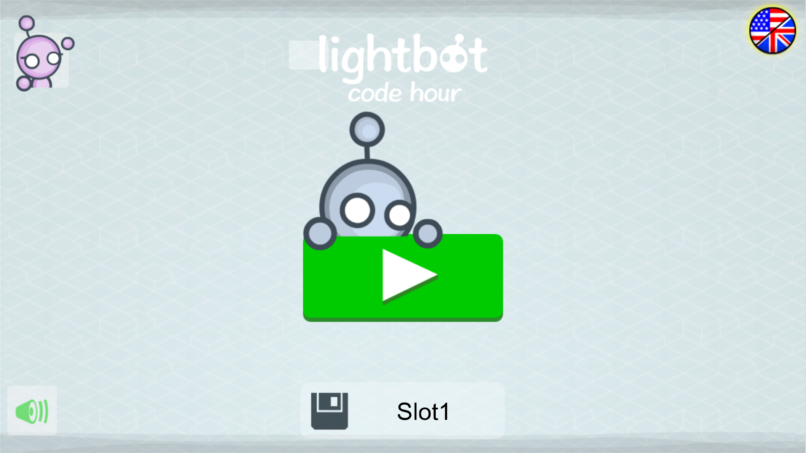
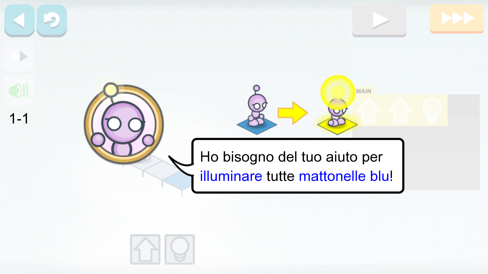
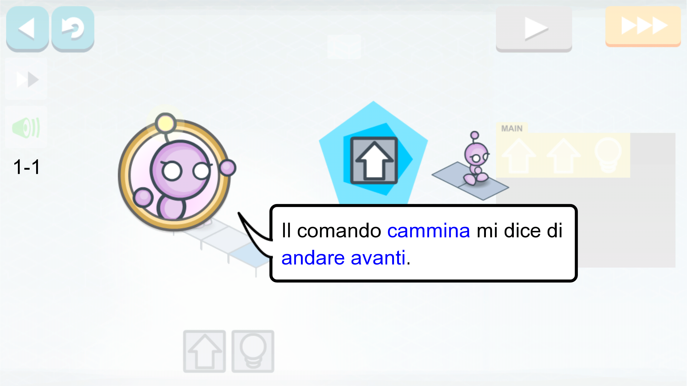
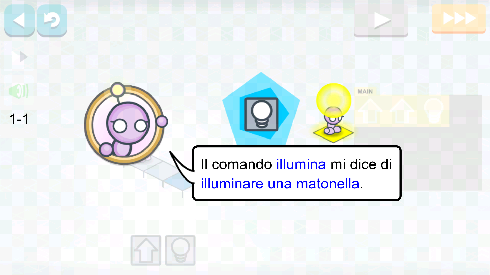
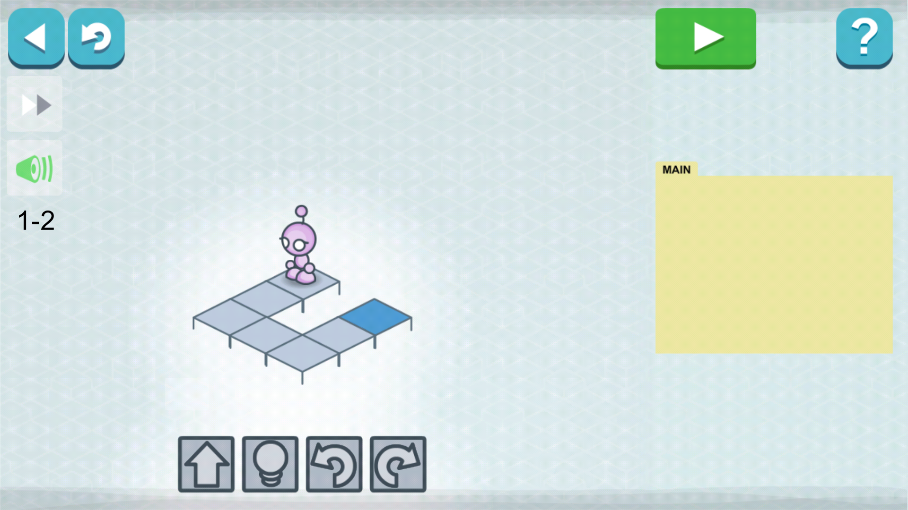
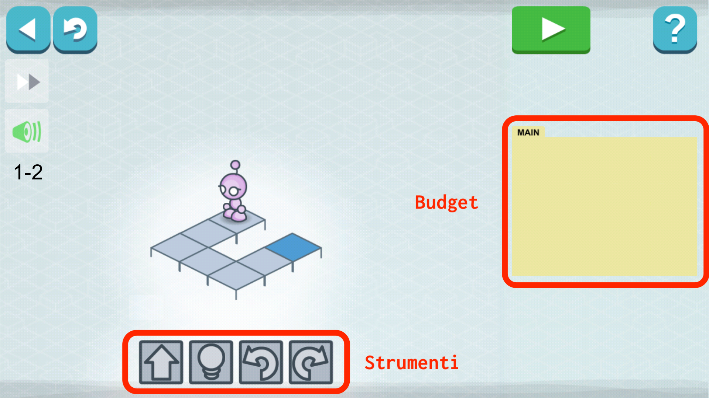
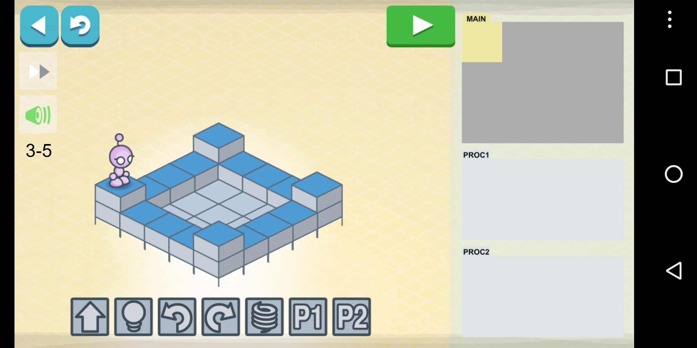

# Lightbot

Per spiegare in maniera pratica cosa intendiamo per risolvere i problemi attraverso storie useremo un'applicazione mobile chiamata [**LightBot**](http://lightbot.com/). Potete scaricare l'applicazione sul vostro smartphone attraverso i seguenti link.

		
		

> Lightbot è pubblicata da [code.org](https://code.org), un'organizzazione nonprofit basata a Seattle (USA) per facilitare l'accesso a scuola della computer science  ed in particolare per incrementare la partecipazione delle donne e minoranze sotto-rappresentate.

# Avvio del programma

Appena aperta l'applicazione di Lightbot, vi comparirà la seguente schermata.

Potete scegliere il bot con sembianze femminili cliccando in alto a sinistra e cambiare lingua dall'icona in alto a destra.

> Già da questi particolari potete notare l'attenzione per l'inclusione e la partecipazione di tutti e tutte alla programmazione. Anche noi dobbiamo cercare di mantenere lo stesso livello di inclusione a scuola ed in tutto quello che facciamo!

Cliccando sull'immagine al centro, cominciamo il nostro viaggio nella programmazione!

# Il problema e la storia
Appena avviato il primo livello, subito il nostro bot si presenta e dichiara i suoi obiettivi.

Possiamo identificare degli elementi fondamentali che caratterizzano _tutte le storie_:

1. **chi ha il problema?**
1. **qual'è il problema?**
1. **perché lo vuole risolvere?**

Nel caso di Lightbot, le risposte a queste domande sono:
1. il bot
1. accendere tutte le mattonelle
1. per passare al livello successivo

Per descrivere un problema si possono mettere questi tre elementi in un unica frase, creando così una _storia utente_. Nelle storie generalmente si preferisce mettere il _verbo in prima persona_, ponendo chi ha il problema come soggetto. La nostra storia utente assume la seguente forma:

<strong>Storia 1</strong>: come bot, voglio accendere tutte le mattonelle per passare al livello successivo

Bene, abbiamo creato la nostra prima storia 😎.

> Ovviamente possiamo individuare vari livelli di problemi. Ad esempio ci possiamo chiedere perché il bot vuole passare di livello, oppure potremmo dire che siamo noi che vogliamo passare di livello per divertirci o per imparare a programmare. 
 
Tutte queste considerazioni sono corrette e possono essere prese in considerazione, creando altre storie. Saremo noi programmatori, di volta in volta, a decidere su quale livello di problema lavorare e quali storie prendere in considerazione.

# Vincoli di progetto
Quando vogliamo risolvere un qualsiasi problema, abbiamo dei limiti che non possiamo superare. Ad esempio potremmo avere denaro o tempo limitati, oppure poca esperienza nel campo o strumenti insufficienti. In ogni caso, per risolvere un problema dobbiamo fare i conti con la nostra realtà, qui e ora. Questi limiti in termine tecnico vengono chiamati _vincoli di progetto_.

> I vincoli tra di loro sono generalmente collegati: ad esempio con i soldi posso comprare strumenti migliori, oppure con il tempo posso studiare per migliorare le mie capacità. L'importante, quando si affronta un problema, è avere ben chiaro quali sono i vincoli.

Continuando il tutorial del primo livello, il bot ci presenta quali sono i nostri **strumenti di lavoro**.

Gli strumenti di lavoro compaiono nella parte bassa dello schermo. Possiamo usare ogni strumento quante volte vogliamo, senza che questi finiscano o si consumino.

Arrivati al secondo livello, avremo la seguente schermata.

Nella parte destra dello schermo abbiamo lo spazio per inserire i nostri comandi. Nel gioco non possiamo inserire più comandi di quelli che entrano in queste caselle. Questo spazio possiamo considerarlo il nostro limite di spesa, detto anche _budget_, oltre il quale non possiamo andare per completare il progetto.

Ricapitolando, finora possiamo individuare due vincoli principali:
- gli **strumenti** che abbiamo a disposizione
- il **budget** che ci è stato assegnato

All'inizio è facile riuscire ad accendere tutte le mattonelle, ma andando avanti le cose diventano più complicate. Ad esempio, uno degli ultimi livelli si presenta così:

Facendo varie prove, si vede presto che il problema è di difficile soluzione perché abbiamo poche caselle a disposizione, in altre parole abbiamo un budget limitato, oppure perché degli strumenti che abbiamo sono insufficienti (sarebbe utile ad esempio un "salta e gira" in un unico comando!). Ma non abbiamo potere su questi vincoli.

A questo punto diventa chiaro l'ultimo vincolo da cui dipende il successo del nostro progetto:
- le **capacità** del nostro team

Per riuscire ad aiutare il bot ad accendere tutte le mattonelle, dobbiamo riflettere, ingegnarci, studiare e chiedere aiuto finché non troviamo la soluzione adatta.

# Risolvere un problema
Come abbiamo detto all'inizio, non tutti i problemi sono risolvibili. In particolare, quando un problema comincia ad essere difficile ci scontreremo prima o poi con uno dei tre vincoli:
- non avere abbastanza budget
- non avere gli strumenti adatti
- non avere capacità sufficienti.

Come essere umani, tendiamo spesso a dare troppa importanza al primo vincolo: non sono riuscito a completare il progetto perché non avevo abbastanza tempo, o soldi, o persone nel team. La realtà è però che il budget, per sua natura, è sempre limitato: non potremo mai aumentare all'infinito i nostri soldi, o il tempo, o le persone che lavorano con noi.

Gli altri due vincoli possiamo aumentarli molto di più: trovare strumenti migliori, studiare, aggiornarsi. La storia della tecnologia in fondo è proprio questa: l'essere umano, mantenendo più o meno costante il budget, è riuscito a risolvere straordinari problemi migliorando continuamente gli strumenti e le proprie capacità: procurarsi il cibo, condividere informazioni, arrivare sempre più lontano. Il nostro percorso di studi si concentrerà su questo: trovare gli strumenti più adatti e migliorare le nostre capacità per risolvere i problemi che dovremo affrontare.
