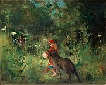

# Processing

Passiamo ora ad un vero ambiente di programmazione che possiamo usare per risolvere problemi e realizzare progetti di vario tipo: [_Processing_](https://processing.org/).

> Da [Wikipedia](https://it.wikipedia.org/wiki/Processing): _"Processing è un linguaggio di programmazione che consente di sviluppare diverse applicazioni come giochi, animazioni, contenuti interattivi e opere d'arte generativa."_  
Per avere un'idea di cosa può essere realizzato con Processing, potete visitare il [tutorial ufficiale](http://hello.processing.org/editor/) che contiene video e un editor online.

Nel caso di Processing, gli strumenti che abbiamo sono le _funzioni_ predefinite, i _costrutti_ del linguaggio ed i _paradigmi_ di programmazione che mette a disposizione.

## La documentazione: un sito da tenere sempre a portata di mano
- Come si disegna un quadrato?
- Come si disegna un cerchio?
- Come si disegna un triangolo?
- Quali parametri devo mettere?
- È possibile disegnare delle linee?
- Si può generare un numero casuale?
- Si può caricare un'immagine? Quale formato devo usare?

La risposta a queste e moltissime altre domande è sempre la stessa: consultare la _documentazione_, detta anche [_"Language Reference"_](https://processing.org/reference/). Questo sito che descrive nel dettaglio i particolari sull'uso di tutte le caratteristiche del linguaggio. È fondamentale che prendiate confidenza con questo sito, non fatevi spaventare dall'inglese: le parole usate sono più o meno sempre le stesse e la costruzione delle frasi molto semplice. Vedrete che farete pratica in poco tempo, e questa conoscenza vi tornerà utile per tutto il resto della vostra vita.

> Quando si impara un nuovo linguaggio, la prima cosa che un buon programmatore deve avere sempre a portata di mano e con cui deve prendere confidenza è il language reference.

> Per esercizio, provate a trovare nel language reference di Processing la risposta alle domande all'inizio di questo paragrafo.

## Scelta del problema: Cappucetto Rosso

Come abbiamo detto, tutto comincia da un problema. Per poter imparare ad usare Processing, dobbiamo prima trovare un nostro problema da risolvere. Per questo corso useremo il racconto di [Cappuccetto Rosso](https://it.wikipedia.org/wiki/Cappuccetto_Rosso) come ispirazione.

In questa favola, tutto comincia con Cappuccetto Rosso che deve andare a consegnare delle focacce alla nonna malata. Possiamo così scrivere la nostra prima _storia utente_, come abbiamo visto nel capitolo precedente:

<strong>Storia 1</strong>: come Cappuccetto Rosso, voglio raggiungere la casa della nonna al di là del bosco per portarle delle focaccine, perché è malata e non può uscire da sola.

Cominciamo ora a realizzare passo dopo passo la nostra applicazione, partendo da zero ed arrivando a creare un _programma_ che realizzi la storia appena descritta.

> Il progetto completo di Cappuccetto Rosso svolto in classe lo trovate qui: [https://github.com/wbigger/cappuccettorosso](https://github.com/wbigger/cappuccettorosso)

## Design
Il passo successivo alla storia è disegnare come dovrà apparire la nostra applicazione. Possiamo fare un disegno su carta o usando un programma di disegno (es. Gimp, Photoshop), ma la cosa importante è che sia chiaro come deve apparire visivamente l'applicazione e che cosa deve fare. Nel nostro caso, possiamo rappresentare l'applicazione con il seguente schema.

</style>

## Immagini e forme
Analizziamo gli elementi della nostra storia che dovremo andare a rappresentare sul nostro schermo:
- Cappuccetto Rosso
- la casa della nonna

Come rappresentiamo questi elementi? Abbiamo fondamentalmente due possibilità:
- attraverso un'_immagine_ (in inglese _image_), caricate ad esempio da un file .png o .jpg (in termine tecnico sono _immagini rasterizzate_)
- attraverso _forme_ (in inglese _shape_), come ad esempio un insieme di ellissi, rettangoli e triangoli (in termine tecnico sono _immagini vettoriali_)

Possiamo scegliere sia l'una che l'altra strada. In generale, una volta presa una scelta, meglio rimanere su quella strada e rendere tutto coerente, mischiare immagini rasterizzate e forme e mantenere un aspetto gradevole può essere molto difficile.

Per il nostro progetto, scegliamo di usare le **forme**, perché in questo momento sono più semplici da creare e manipolare, e in futuro possiamo usare facilmente delle forme tridimensionali.

Andando a consultare la documentazione per vedere come si disegnano le forme in Processing. Troviamo che quello di cui abbiamo bisogno si chiama **PShape** (abbreviazione di _Processing Shape_). Fortunatamente Processing mette a disposizione un [tutorial](https://processing.org/tutorials/pshape/) completo per il suo utilizzo.

> Per rappresentare immagini si usa invece il tipo **PImage**
