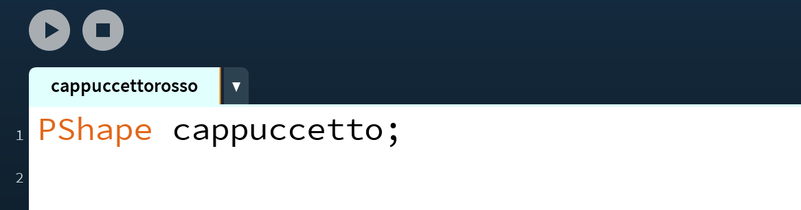
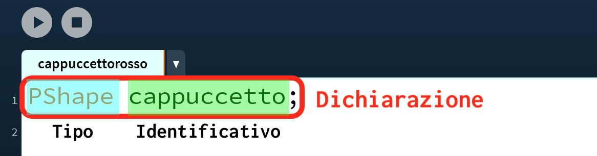
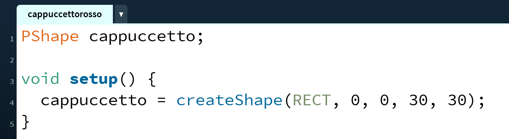
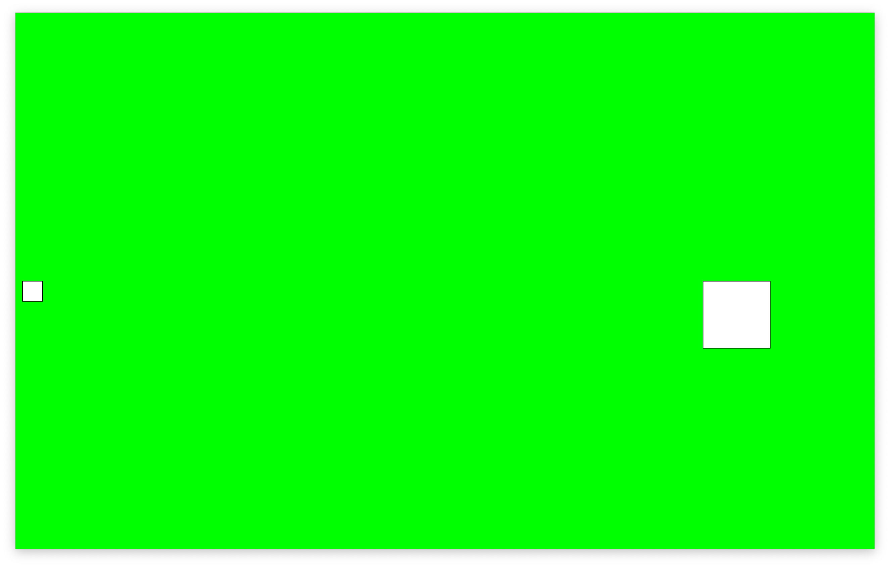
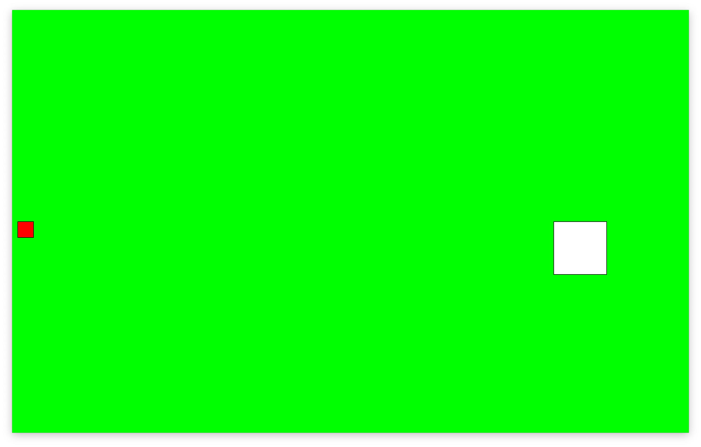
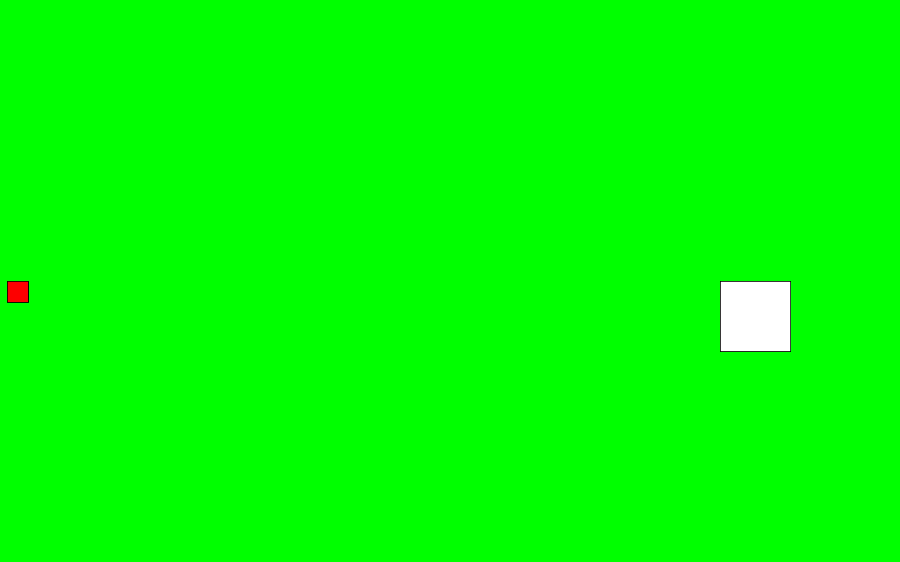

# Variabili
Per rappresentare Cappuccetto Rosso, abbiamo bisogno di riservare un pezzettino della nostra memoria RAM che conterrà tutte le informazioni necessarie per disegnarla, come ad esempio dimensione, colore, etc. per riservare un'area di memoria RAM di questo genere ci serve una **variabile**.

Apriamo l'IDE di Processing, e salviamo il progetto vuoto che ci si presenta con il nome `cappuccettorosso`.

Nella prima riga, creiamo la nostra prima variabile PShape.
<style>
img.center {
  width: 75%;
}
</style>
<p align=center>

</p>

Analizziamo nel dettaglio quello che abbiamo appena scritto:
<p align=center>

</p>

La creazione di una variabile in termine tecnico si chiama **dichiarazione**. La dichiarazione ha due componenti:
- il **tipo** della variabile, che determina la quantità di spazio occupata in memoria e le caratteristiche della variabile
- l'**identificativo**, che è il _nome_ con cui nel resto del programma possiamo riferirci alla variabile.

È di estrema importanza che l'identificativo sia chiaro ed autoesplicativo: evitate di usare nomi come `a`, `b` o simili e preferite i nomi che hanno un senso all'interno della storia in cui vi trovate.

> La favola di Cappuccetto Rosso non sarebbe stata la stessa se la bambina si fosse chiamata `a` o `stivaletti blu`!

Appena dichiarata, la variabile non ha alcun valore significativo. Spesso usare una variabile solo dichiarata porta ad un errore in esecuzione con relativo _crash_ dell'applicazione. Dopo aver dichiarato una variabile bisogna quindi dargli un valore, questa operazione si chiama **assegnazione**.

Assegniamo quindi il valore della nostra variabile nella funzione `setup()` del nostro programma. La mettiamo in setup perché, una volta assegnata la forma, questa _non_ cambierà per tutto il resto del programma.

<p align=center>

</p>

Come vediamo, l'assegnazione si fa usando il segno `=` e mettendo a sinistra l'identificativo della nostra variabile e a destra il valore che vogliamo assegnare. In questo caso facciamo creare la forma alla funzione [`createShape()`](https://processing.org/reference/createShape_.html), ed in particolare ci facciamo creare un rettangolo che ha inizialmente posizione `0,0`, altezza `30` e larghezza `30`.

Procedendo in maniera simile per la casa, otteniamo il seguente codice:

```java
PShape cappuccetto;
PShape house;

void setup() {
  fullScreen(); // usa tutto lo schermo
  cappuccetto = createShape(RECT, 0, 0, 30, 30);
  house = createShape(RECT, 0, 0, 100, 100);
}
```

Ora, nella funzione `draw()`, vogliamo disegnare cappuccetto rosso a sinistra e la casetta della nonna a destra. Sempre consultando la documentazione, scopriamo che per disegnare una forma possiamo usare la funzione [`shape()`](https://processing.org/reference/shape_.html). Esistono diversi modi di usare `shape`, a noi fa comodo la versione `shape(shape, x, y)`, in cui possiamo specificare le coordinate `x,y` in cui andremo a disegnare la forma.

```java
void draw() {
  background(#00FF00); // siamo nella foresta, lo sfondo è verde

  //disegniamo la casa a destra, a metà altezza dello schermo
  shape(house, width*0.8, height*0.5);

  //disegniamo cappuccetto rosso a sinistra, a metà altezza dello schermo
  shape(cappuccetto, 10, height*0.5);
}
```

Se provate ad eseguire questo codice, avrete una schermata simile alla seguente.


<p align=center>

</p>

Va quasi bene! Dobbiamo però cambiare il colore della bambina in rosso. Come facciamo? Come al solito, andiamo sulla documentazione di [PShape](https://processing.org/reference/PShape.html), scorriamo un po' e scopriamo che esiste un metodo chiamato `setFill()` che serve proprio per questo.

> Ci sono altre soluzioni per colorare la forma, ad esempio quella che già conosciamo di usare la funzione `fill()` subito prima di disegnare la forma. Però noi useremo setFill() perché ci permette di colorare la nostra forma senza influenzare il resto del disegno.

Avendo trovato `setFill()` _dentro_ la documentazione di PShape, dobbiamo usare una notazione particolare per poterla chiamare:
```java
void setup() {
  fullScreen(); // usa tutto lo schermo
  cappuccetto = createShape(RECT, 0, 0, 30, 30);
  cappuccetto.setFill(color(255,0,0)); // riempimento rosso
  house = createShape(RECT, 0, 0, 100, 100);
}
```

<p align=center>

</p>

OK! Ora ci rimane solo da far muovere cappuccetto rosso da sinistra a destra. Per fare questo, creiamo una nuova variabile che conterrà la posizione del personaggio. Il _tipo_ di questa variabile è un numero intero, che in Processing si chiama `int`; come identificativo possiamo usare `xCappuccetto`, per far capire che è la coordinata `x` della variabile `cappuccetto`. Assegniamo anche il valore iniziale 10.

<p align=center>

</p>

Questa volta, per comodità, abbiamo dichiarato la variabile ed assegnato il valore sulla stessa riga, ma ricordiamoci che sono comunque due operazioni differenti.

Per far muovere cappuccetto, sostituamo la coordinata x nella funzione `shape()` con questa nuova variabile, e ricordiamoci di incrementarla ad ogni ciclo. Il risultato finale è il seguente.

```java
PShape cappuccetto;
PShape house;
int xCappuccetto = 10;

void setup() {
  fullScreen(); // usa tutto lo schermo
  cappuccetto = createShape(RECT, 0, 0, 30, 30);
  cappuccetto.setFill(color(255,0,0));
  house = createShape(RECT, 0, 0, 100, 100);
}

void draw() {
  background(#00FF00); // siamo nella foresta, lo sfondo è verde

  //disegniamo la casa a destra, a metà altezza dello schermo
  shape(house, width*0.8, height*0.5);

  //disegniamo cappuccetto a metà altezza dello schermo
  shape(cappuccetto, xCappuccetto, height*0.5);

  // incremento la coordinata x di cappuccetto
  xCappuccetto = xCappuccetto + 5;
}
```
<p align=center>

</p>


Mh... Cappuccetto Rosso ora si sposta ma continua anche oltre la casa della nonna...🤔 Dobbiamo aggiungere una condizione che faccia in modo tale che la bambina avanzi solo se ancora non è arrivata alla casa.
