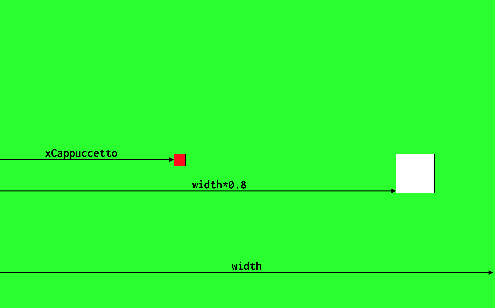
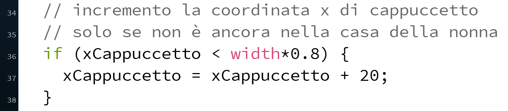
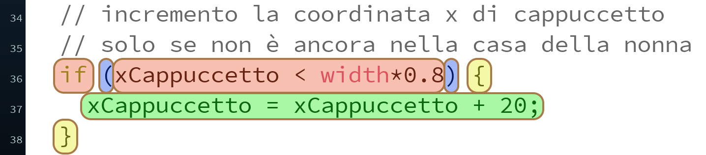
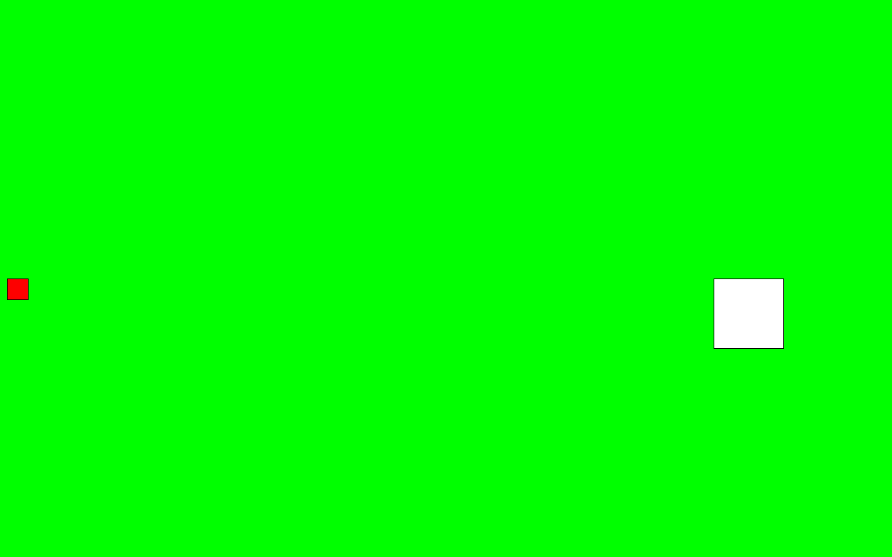

# Controllo di flusso: condizioni
Per fermare Cappuccetto Rosso solo quando arriva dentro la casa, ci serve di aggiungere una _condizione_, qualcosa del tipo: _se_ accade questo _allora_ fai questo. In inglese _se_ si traduce con _if_ e allora si traduce con _then_. La struttura di controllo in programmazione si chiama infatti _if-then_.

Subito dopo l'`if` dobbiamo mettere una condizione, ovvero qualcosa che possa essere **vero o falso**. Nel nostro caso vogliamo che l'incremento della posizione di Cappuccetto Rosso avvenga _solo se_ non è ancora arrivata alla casa. Vediamo graficamente le variabili rappresentate sullo schermo.

<p align=center>

</p>

In codice possiamo tradurre il concetto "solo se xCappuccetto è minore di width*0.8, fai avanzare cappuccetto" come segue:

<p align=center>

</p>

Vediamo nel dettaglio queste istruzioni:
<p align=center>

</p>

Tutto inizia con `if`, che è una parola speciale nel linguaggio di Processing, e per questo viene chiamata **keyword**. Subito dopo, tra **parentesi tonde**, c'è la condizione: in questo caso la posizione x di Cappuccetto Rosso deve essere minore di `width*0.8`, che è esattamente la posizione della casa. Come possiamo vedere, questa condizione può essere solo vera o falsa, non ci sono altre possibilità nel mezzo. Dopo le parentesi tonde ci sono delle **parentesi graffe** che racchiudono le istruzioni da eseguire, solo se la condizione è vera.

Il risultato finale è quello che segue.
<p align=center>

</p>

E questo è il codice relativo.
```java
PShape cappuccetto;
PShape house;
int xCappuccetto = 10;

void setup() {
  fullScreen(); // usa tutto lo schermo

  cappuccetto = createShape(RECT, 0, 0, 30, 30);
  cappuccetto.setFill(color(255,0,0));

  house = createShape(RECT, 0, 0, 100, 100);
}

void draw() {
  background(#00FF00); // siamo nella foresta, lo sfondo è verde

  //disegniamo la casa a destra, a metà altezza dello schermo
  shape(house, width*0.8, height*0.5);

  //disegniamo cappuccetto a metà altezza dello schermo
  shape(cappuccetto, xCappuccetto, height*0.5);

  // incremento la coordinata x di cappuccetto
  // solo se non è ancora nella casa della nonna
  if (xCappuccetto < width*0.8) {
    xCappuccetto = xCappuccetto + 5;
  }
}
```
