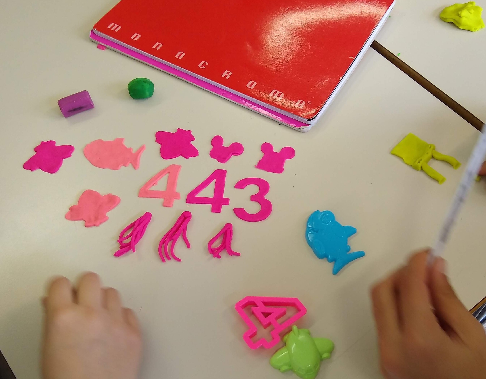

<style>
img.center {
  width: 75%;
}
</style>

# Le classi

Abbiamo detto che un linguaggio di programmazione ci serve per risolvere problemi nel mondo reale. Per poter svolgere correttamente il suo lavoro, il linguaggio deve permetterci di rappresentare facilmente i concetti del mondo reale a cui facciamo riferimento.

Ad esempio, nel mio progetto ora ho le variabili cappuccetto rosso e la casa della nonna. Guardando semplicemente il codice, le variabili `cappuccetto` e `house` sono create ed usate in modo molto simile, non sono legate ad un concetto particolare distinto. L'unica cosa che differenzia le due variabili è il nome, a cui il programmatore umano sa dare un senso, ma per il computer  (in questo caso il __compilatore__) i nomi delle variabili sono semplicemente un insieme di caratteri senza un particolare significato.

> Il __compilatore__ è il software che interpreta il codice che abbiamo scritto e lo traduce in linguaggio macchina. Se ci sono degli errori di sintassi nel nostro codice, il compilatore non riuscirà ad interpretarlo correttamente e ci restituirà un errore.

Si possono dare maggiori indizi al compilatore (e ai programmatori del mio team) per poter gestire meglio i diversi tipi di variabili?

La risposta è _sì_, e il modo in cui si fa è tramite la creazione di nuovi assegnare _tipi_ da assegnare alle variabili. Ad esempio possiamo dire che `cappuccetto` è una Bambina, o un Personaggio della mia storia, o quello che vogliamo.

> Analogamente, `house` potrebbe essere di _tipo_ `Edificio`.

Come facciamo in pratica a fare una cosa del genere? Per creare nuovi tipi in Processing il modo più semplice è dichiarare una _classe_.

## Classi
Le classi in informatica sono come degli _stampini_ che servono per creare degli _oggetti_. Rivediamo un attimo l'attività che abbiamo fatto in classe.

<p align="center">

</p>

Gli stampini che avete usato avevano una forma ben definita: aereo, squalo, numero, etc. Potevate usare ogni stampino per creare tanti _oggetti dello stesso tipo_, ad esempio tanti aerei. Gli oggetti così creati saranno tutti molto simili fra loro, ma non perfettamente uguali: nel momento della creazione o dopo averlo stampato, possiamo modificarli un pochino.

> Un vantaggio di usare questi stampini/classi è che possiamo creare velocemente degli oggetti simili tra di loro. Lo svantaggio è, che se dobbiamo modificare molto l'oggetto dopo la crezione, le cose cominciano a diventare complicate. Non c'è una regola assoluta per la scelta: in generale, cercate di mantenere il _senso_ di quello che state facendo: non cercate di trasformare la formina di un aereo in un pesce, o viceversa.

## Dichiarazione di una classe
Ipotizziamo che, nel nostro progetto, vogliamo che cappuccetto rosso sia un Personaggio. Per prima cosa, definiamo un nuovo tipo.

```java
class Personaggio {}
```

Vediamo bene la sintassi, in ordine da sinistra a destra:
- la keyword `class`, che dichiara una nuova classe
- l'_identificativo_ della classe, in questo caso la `Personaggio`
- le parentesi graffe, che rappresentano il _corpo_ (in inglese _body_) della classe

Proviamo ad usare questo nuovo tipo.

```java
class Personaggio {};
Personaggio cappuccetto;
```

OK, abbiamo fatto in modo di esplicitare che cappuccetto rosso non è una forma qualsiasi, ma un Personaggio!

A questo punto però, se proviamo a compilare il programma, ci restituisce un errore quando proviamo ad assegnare `cappuccetto` con `createShape(...)`. L'errore è il seguente:

```
Type mismatch, "PShape" does not match with "Personaggio".
```

Perché questa cosa? Riflettiamo: stiamo provando ad assegnare alla nostra variabile `cappuccetto` una forma, ma adesso il tipo è cambiato, e il compilatore non sa come assegnare una forma ad un personaggio. È giunto il momento di scrivere qualcosa nel corpo della classe.

### Costruttore
Per prima cosa, dobbiamo dire che il nostro personaggio ha una forma. Inseriamo quindi all'interno della classe la dichiarazione di una variabile forma:

```java
class Personaggio {
  PShape forma;
};
```

Guardate bene: abbiamo dichiarato una variabile di tipo forma _dentro_ la classe personaggio. Bisogna quindi tenere in considerazione che:
- si può usare questa variabile solo se si sta utilizzando un personaggio
- ogni personaggio avrà una forma diversa

Finora abbiamo _dichiarato_ la variabile `forma`, ma quando la assegniamo? L'assegnazione delle variabili della classe di solito avviene all'interno di una funzione speciale, chiamata _costruttore_. Questa funzione ha lo stesso nome della classe, e non bisogna specificare il valore di ritorno.

```java
class Personaggio {
  PShape forma;
  Personaggio() { // questo è il costruttore!
    // qui dentro ci mettiamo quello che ci serve per inizializzare il nostro oggetto
    forma = createShape(RECT, 0, 0, 30, 30);
  }
};
```

Ora dobbiamo andare ad assegnare il valore corretto alla variabile `cappuccetto`. Questo si fa tramite una nuova keyword: `new`.

```java
void setup() {
  // ...
  // Utilizziamo la keyword new per "stampare" un nuovo oggetto dalla classe
  cappuccetto = new Personaggio();
}
```

OK, ora non abbiamo più l'errore di prima ma ne è comparso un altro per riga dopo:

```java
cappuccetto.setFill(color(255,0,0));
```
```
The function "setFill(int)" does not exist.
```

Perché questo? Cerchiamo di capire bene: abbiamo utilizzato il simbolo punto (`.`) subito dopo la variabile `cappuccetto`. Cosa significa questo punto? Risposta: significa che stiamo andando a richiamare variabili e funzioni _all'interno_ della classe di cui fa parte cappuccetto, in questo caso `Personaggio`. In effetti, se andiamo a vedere dentro la classe c'è solo il costruttore,  non esiste un metodo `setFill()`.

Ci sono varie soluzioni possibili: una potrebbe essere creare il metodo che ci serve. Per ora però usiamo una strategia diversa: visto che il `setFill()` fa parte della creazione del personaggio, spostiamo questo metodo dentro il costruttore della classe:

```java
class Personaggio {
  PShape forma;
  Personaggio() {
    forma = createShape(RECT, 0, 0, 30, 30);
    forma.setFill(color(255,0,0));
  }
};
```

Fate attenzione: abbiamo richiamato `setFill()` sulla variabile `forma`, perché all'interno della classe, è questa variabile a dover cambiare colore.

OK, anche questo errore è risolto. Ma ne abbiamo ancora uno (l'ultimo, per fortuna):

```java
shape(cappuccetto, xCappuccetto, height*0.5);
```
```
The function "shape()" expects parameters like: "shape(PShape,  float,  float)"
```

Questo perché la funzione `shape()` si aspetta come primo parametro una variabile di tipo `PShape`, ma noi gli stiamo passando una variabile di tipo `Personaggio`.

Per risolvere questo problema, possiamo creare una funzione `disegna()` dentro la classe Personaggio, che, come dice il nome, disegna il nostro personaggio. Proviamo.

```java
class Personaggio {
  //...
  void disegna() {
    shape(forma, xCappuccetto, height*0.5);
  }
};

void draw() {}
  // ...
  // chiamiamo il nuovo metodo disegna()
  cappuccetto.disegna();
}
```

OK, ora funziona tutto!

Scriviamo di seguito il codice completo, per riferimento.

```java
Personaggio cappuccetto;
PShape house;
int xCappuccetto = 10;

class Personaggio {
  PShape forma;
  Personaggio() {
    forma = createShape(RECT, 0, 0, 30, 30);
    forma.setFill(color(255,0,0));
  }
  void disegna() {
    shape(forma, xCappuccetto, height*0.5);
  }
};

void setup() {
  fullScreen(); // usa tutto lo schermo

  cappuccetto = new Personaggio();

  house = createShape(RECT, 0, 0, 100, 100);
}

void draw() {
  background(#00FF00); // siamo nella foresta, lo sfondo è verde

  //disegniamo la casa a destra, a metà altezza dello schermo
  shape(house, width*0.8, height*0.5);

  //disegniamo cappuccetto a metà altezza dello schermo
  cappuccetto.disegna();
  // incremento la coordinata x di cappuccetto
  // solo se non è ancora nella casa della nonna
  if (xCappuccetto < width*0.8) {
    xCappuccetto = xCappuccetto + 5;
  }
}
```
