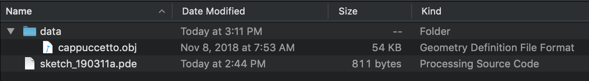
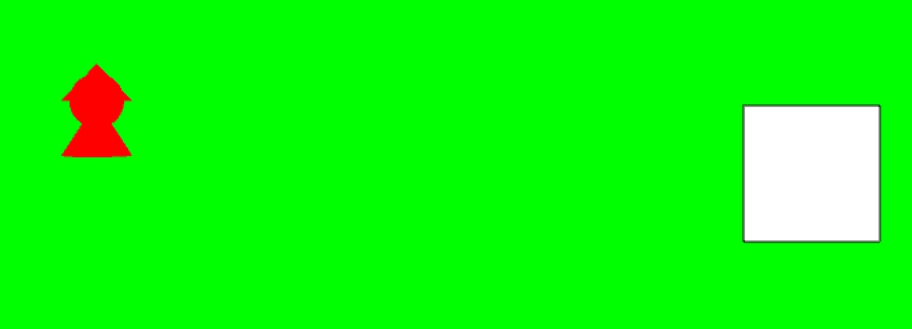
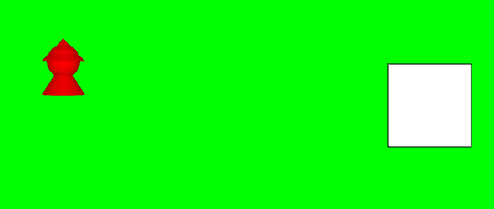

<style>
img.center {
  width: 75%;
}
img.center-100 {
  width: 100%;
}

</style>

# Passiamo al 3D
Finora abbiamo usato Processing per disegnare in due dimensioni: rettangoli, quadrati, ellissi, etc. E se volessimo disegnare in tre dimensioni, come ad esempio cubi, sfere o forme più complesse?

Passare al 3D con Processing è molto semplice, in quanto questo linguaggio è nato in realtà proprio per rendere semplice la creazione di applicazioni in tre dimensioni. Seguiremo ora passo passo le operazioni da fare per passare dal 2D al 3D.

## Dichiariamo di voler utilizzare le funzionalità 3D
Prima di tutto dobbiamo dichiarare esplicitamente che vogliamo utilizzare le funzionalità 3D di Processing. Questo va fatto aggiungendo il parametro `P3D` alla funzione `fullScreen()` o alla funzione`size()`.

```java
void setup() {
  fullScreen(P3D);
  //...
}
```

## Carichiamo un modello 3D
Ora che siamo in 3D, possiamo caricare modelli tridimensionali. Processing attualmente supporta unicamente il formato `.obj`, quindi dobbiamo fare attenzione a cercare dei modelli in questo formato o a convertirlo opportunamente, ad esempio con [Blender](https://www.blender.org).

> Per convertire un file con Blender, aprire un nuovo progetto, eliminare il cubo di default, importare il file dal formato di origine (es. `.fbx`, `.stl`, `.gltf`), eventualmente modificarlo come necessario (rotazione, scalatura, etc.), quindi esportarlo in formato `.obj`.

Per il nostro esempio, useremo un modello di Cappuccetto Rosso disponibile qui: [cappuccetto.obj](https://raw.githubusercontent.com/wbigger/book-programming/master/src/cappuccetto.obj). Scaricate il file e salvatelo all'interno della vostra cartella di progetto, nella sottocartella `data/`.

L'organizzazione dei file e delle cartelle deve essere il seguente:
<p align="center">

</p>

Adesso, per importare il modello, dobbiamo usare la funzione `loadShape()`:

```java
forma = loadShape("cappuccetto.obj");
```

 Attenzione: anche in questo caso, parametrizziamo il costruttore per fare in modo di scegliere nel momento in cui viene creato l'oggetto, quale modello si vuole importare. In questo caso, `"cappuccetto.obj"` è di tipo stringa, quindi il nostro costruttore diventerà:

```java
Personaggio(String filename, color col) {
    forma = loadShape(filename);
    forma.setFill(col);
}
```
e per creare l'oggetto scriveremo:
```java
cappuccetto = new Personaggio("cappuccetto.obj", color(255,0,0));
```

Se eseguiamo il nostro progetto, otterremo una cosa del genere:
<p align="center">

</p>

Va quasi bene, ma il nostro modello sembra un po' troppo "piatto". In effetti, di default Processing mostra solo l'ombra del nostro modello. Per visualizzare qualcosa di più tridimensionale, dobbiamo "accendere le luci" attraverso la funzione `lights()` da chiamare all'interno di `draw()`.

```java
void draw() {
  background(#00FF00);
  lights();
  //...
}
```

Ora otteniamo qualcosa del genere:
<p align="center">

</p>

Bene, era quello che volevamo!

## Nota sulla direzione degli assi

Di default, Processing ha l'asse z rivolto verso il basso. Questa convenzione è opposta a quella usata comunemente, in cui l'asse z punta verso l'alto.

Per risolvere il problema, ci sono varie soluzioni. Per ora ve ne consiglio due:
- modificare l'orientamento dell'`.obj`, ad esempio attraverso Blender con la combinazione di tasti r-x-180 invio
- ruotare il modello da dentro Processing ruotandolo di 180 gradi attorno all'asse X, subito dopo aver caricato il modello (applicando quindi `.rotateX(radians(180))`)
