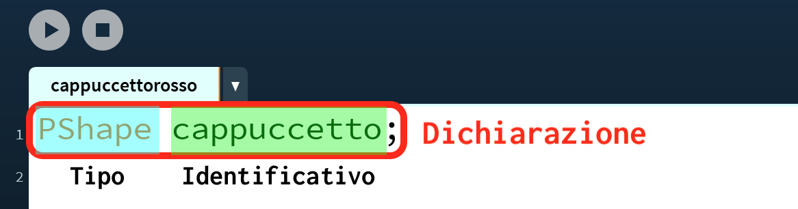
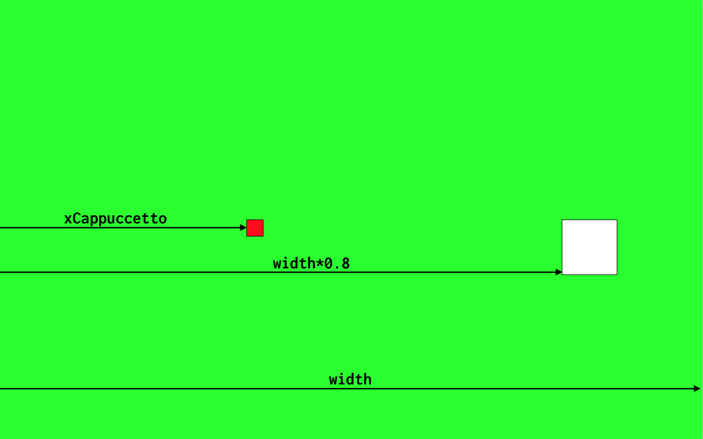

# Processing

Passiamo ora ad un vero ambiente di programmazione che possiamo usare per risolvere problemi e realizzare progetti di vario tipo: [_Processing_](https://processing.org/).

> Da [Wikipedia](https://it.wikipedia.org/wiki/Processing): _"Processing è un linguaggio di programmazione che consente di sviluppare diverse applicazioni come giochi, animazioni, contenuti interattivi e opere d'arte generativa."_<br><br>
Per avere un'idea di cosa può essere realizzato con Processing, potete visitare il [tutorial ufficiale](http://hello.processing.org/editor/) che contiene video e un editor online.

Nel caso di Processing, gli strumenti che abbiamo sono le _funzioni_ predefinite, i _costrutti_ del linguaggio ed i _paradigmi_ di programmazione che mette a disposizione.

## La documentazione: un sito da tenere sempre a portata di mano
- Come si disegna un quadrato?
- Come si disegna un cerchio?
- Come si disegna un triangolo?
- Quali parametri devo mettere?
- È possibile disegnare delle linee?
- Si può generare un numero casuale?
- Si può caricare un'immagine? Quale formato devo usare?

La risposta a queste e moltissime altre domande è sempre la stessa: consultare la _documentazione_, detta anche [_"Language Reference"_](https://processing.org/reference/). Questo sito che descrive nel dettaglio i particolari sull'uso di tutte le caratteristiche del linguaggio. È fondamentale che prendiate confidenza con questo sito, non fatevi spaventare dall'inglese: le parole usate sono più o meno sempre le stesse e la costruzione delle frasi molto semplice. Vedrete che farete pratica in poco tempo, e questa conoscenza vi tornerà utile per tutto il resto della vostra vita.

> Quando si impara un nuovo linguaggio, la prima cosa che un buon programmatore deve avere sempre a portata di mano e con cui deve prendere confidenza è il language reference.

> Per esercizio, provate a trovare nel language reference di Processing la risposta alle domande all'inizio di questo paragrafo.


## Scelta del problema: Cappucetto Rosso
<style>
.left_side {
  float:left;
  margin:5px 20px 0px 5px;
}
p.clear {
  clear: both;  
}
</style>

<a href="https://it.wikipedia.org/wiki/Cappuccetto_Rosso#/media/File:Carl_Larsson_-_Little_Red_Riding_Hood_1881.jpg">

</a>
Come abbiamo detto, tutto comincia da un problema. Per poter imparare ad usare Processing, dobbiamo prima trovare un nostro problema da risolvere. Per questo corso useremo il racconto di [Cappuccetto Rosso](https://it.wikipedia.org/wiki/Cappuccetto_Rosso) come ispirazione.

In questa favola, tutto comincia con Cappuccetto Rosso che deve andare a consegnare delle focacce alla nonna malata. Possiamo così scrivere la nostra prima _storia utente_, come abbiamo visto nel capitolo precedente:

<p class="clear"></p>
<p align="center">
<strong>Storia 1</strong>: come Cappuccetto Rosso, voglio raggiungere la casa della nonna al di là del bosco per portarle delle focaccine, perché è malata e non può uscire da sola.
</p>

Cominciamo ora a realizzare passo dopo passo la nostra applicazione, partendo da zero ed arrivando a creare un _programma_ che realizzi la storia appena descritta.

> Il progetto completo di Cappuccetto Rosso svolto in classe lo trovate qui: [https://github.com/wbigger/cappuccettorosso](https://github.com/wbigger/cappuccettorosso)

## Design
Il passo successivo alla storia è disegnare come dovrà apparire la nostra applicazione. Possiamo fare un disegno su carta o usando un programma di disegno (es. Gimp, Photoshop), ma la cosa importante è che sia chiaro come deve apparire visivamente l'applicazione e che cosa deve fare. Nel nostro caso, possiamo rappresentare l'applicazione con il seguente schema.

</style>
<p align=center>

</p>


## Immagini e forme
Analizziamo gli elementi della nostra storia che dovremo andare a rappresentare sul nostro schermo:
- Cappuccetto Rosso
- la casa della nonna

Come rappresentiamo questi elementi? Abbiamo fondamentalmente due possibilità:
- attraverso un'_immagine_ (in inglese _image_), caricate ad esempio da un file .png o .jpg (in termine tecnico sono _immagini rasterizzate_)
- attraverso _forme_ (in inglese _shape_), come ad esempio un insieme di ellissi, rettangoli e triangoli (in termine tecnico sono _immagini vettoriali_)

Possiamo scegliere sia l'una che l'altra strada. In generale, una volta presa una scelta, meglio rimanere su quella strada e rendere tutto coerente, mischiare immagini rasterizzate e forme e mantenere un aspetto gradevole può essere molto difficile.

Per il nostro progetto, scegliamo di usare le **forme**, perché in questo momento sono più semplici da creare e manipolare, e in futuro possiamo usare facilmente delle forme tridimensionali.

Andando a consultare la documentazione per vedere come si disegnano le forme in Processing. Troviamo che quello di cui abbiamo bisogno si chiama **PShape** (abbreviazione di _Processing Shape_). Fortunatamente Processing mette a disposizione un [tutorial](https://processing.org/tutorials/pshape/) completo per il suo utilizzo.

> Per rappresentare immagini si usa invece il tipo **PImage**

## Variabili
Per rappresentare Cappuccetto Rosso, abbiamo bisogno di riservare un pezzettino della nostra memoria RAM che conterrà tutte le informazioni necessarie per disegnarla, come ad esempio dimensione, colore, etc. per riservare un'area di memoria RAM di questo genere ci serve una **variabile**.

Apriamo l'IDE di Processing, e salviamo il progetto vuoto che ci si presenta con il nome `cappuccettorosso`.

Nella prima riga, creiamo la nostra prima variabile PShape.
<style>
img.center {
  width: 75%;
}
</style>
<p align=center>

</p>

Analizziamo nel dettaglio quello che abbiamo appena scritto:
<p align=center>

</p>

La creazione di una variabile in termine tecnico si chiama **dichiarazione**. La dichiarazione ha due componenti:
- il **tipo** della variabile, che determina la quantità di spazio occupata in memoria e le caratteristiche della variabile
- l'**identificativo**, che è il _nome_ con cui nel resto del programma possiamo riferirci alla variabile.

È di estrema importanza che l'identificativo sia chiaro ed autoesplicativo: evitate di usare nomi come `a`, `b` o simili e preferite i nomi che hanno un senso all'interno della storia in cui vi trovate.

> La favola di Cappuccetto Rosso non sarebbe stata la stessa se la bambina si fosse chiamata `a` o `stivaletti blu`!

Appena dichiarata, la variabile non ha alcun valore significativo. Spesso usare una variabile solo dichiarata porta ad un errore in esecuzione con relativo _crash_ dell'applicazione. Dopo aver dichiarato una variabile bisogna quindi dargli un valore, questa operazione si chiama **assegnazione**.

Assegniamo quindi il valore della nostra variabile nella funzione `setup()` del nostro programma. La mettiamo in setup perché, una volta assegnata la forma, questa _non_ cambierà per tutto il resto del programma.

<p align=center>

</p>

Come vediamo, l'assegnazione si fa usando il segno `=` e mettendo a sinistra l'identificativo della nostra variabile e a destra il valore che vogliamo assegnare. In questo caso facciamo creare la forma alla funzione [`createShape()`](https://processing.org/reference/createShape_.html), ed in particolare ci facciamo creare un rettangolo che ha inizialmente posizione `0,0`, altezza `30` e larghezza `30`.

Procedendo in maniera simile per la casa, otteniamo il seguente codice:

```java
PShape cappuccetto;
PShape house;

void setup() {
  fullScreen(); // usa tutto lo schermo
  cappuccetto = createShape(RECT, 0, 0, 30, 30);
  house = createShape(RECT, 0, 0, 100, 100);
}
```

Ora, nella funzione `draw()`, vogliamo disegnare cappuccetto rosso a sinistra e la casetta della nonna a destra. Sempre consultando la documentazione, scopriamo che per disegnare una forma possiamo usare la funzione [`shape()`](https://processing.org/reference/shape_.html). Esistono diversi modi di usare `shape`, a noi fa comodo la versione `shape(shape, x, y)`, in cui possiamo specificare le coordinate `x,y` in cui andremo a disegnare la forma.

```java
void draw() {
  background(#00FF00); // siamo nella foresta, lo sfondo è verde

  //disegniamo la casa a destra, a metà altezza dello schermo
  shape(house, width*0.8, height*0.5);

  //disegniamo cappuccetto rosso a sinistra, a metà altezza dello schermo
  shape(cappuccetto, 10, height*0.5);
}
```

Se provate ad eseguire questo codice, avrete una schermata simile alla seguente.


<p align=center>

</p>

Va quasi bene! Dobbiamo però cambiare il colore della bambina in rosso. Come facciamo? Come al solito, andiamo sulla documentazione di [PShape](https://processing.org/reference/PShape.html), scorriamo un po' e scopriamo che esiste un metodo chiamato `setFill()` che serve proprio per questo.

> Ci sono altre soluzioni per colorare la forma, ad esempio quella che già conosciamo di usare la funzione `fill()` subito prima di disegnare la forma. Però noi useremo setFill() perché ci permette di colorare la nostra forma senza influenzare il resto del disegno.

Avendo trovato `setFill()` _dentro_ la documentazione di PShape, dobbiamo usare una notazione particolare per poterla chiamare:
```java
void setup() {
  fullScreen(); // usa tutto lo schermo
  cappuccetto = createShape(RECT, 0, 0, 30, 30);
  cappuccetto.setFill(color(255,0,0)); // riempimento rosso
  house = createShape(RECT, 0, 0, 100, 100);
}
```

<p align=center>

</p>

OK! Ora ci rimane solo da far muovere cappuccetto rosso da sinistra a destra. Per fare questo, creiamo una nuova variabile che conterrà la posizione del personaggio. Il _tipo_ di questa variabile è un numero intero, che in Processing si chiama `int`; come identificativo possiamo usare `xCappuccetto`, per far capire che è la coordinata `x` della variabile `cappuccetto`. Assegniamo anche il valore iniziale 10.

<p align=center>

</p>

Questa volta, per comodità, abbiamo dichiarato la variabile ed assegnato il valore sulla stessa riga, ma ricordiamoci che sono comunque due operazioni differenti.

Per far muovere cappuccetto, sostituamo la coordinata x nella funzione `shape()` con questa nuova variabile, e ricordiamoci di incrementarla ad ogni ciclo. Il risultato finale è il seguente.

```java
PShape cappuccetto;
PShape house;
int xCappuccetto = 10;

void setup() {
  fullScreen(); // usa tutto lo schermo
  cappuccetto = createShape(RECT, 0, 0, 30, 30);
  cappuccetto.setFill(color(255,0,0));
  house = createShape(RECT, 0, 0, 100, 100);
}

void draw() {
  background(#00FF00); // siamo nella foresta, lo sfondo è verde

  //disegniamo la casa a destra, a metà altezza dello schermo
  shape(house, width*0.8, height*0.5);

  //disegniamo cappuccetto a metà altezza dello schermo
  shape(cappuccetto, xCappuccetto, height*0.5);

  // incremento la coordinata x di cappuccetto
  xCappuccetto = xCappuccetto + 5;
}
```
<p align=center>

</p>


Mh... Cappuccetto Rosso ora si sposta ma continua anche oltre la casa della nonna...🤔 Dobbiamo aggiungere una condizione che faccia in modo tale che la bambina avanzi solo se ancora non è arrivata alla casa.

## Controllo di flusso: condizioni
Per fermare Cappuccetto Rosso solo quando arriva dentro la casa, ci serve di aggiungere una _condizione_, qualcosa del tipo: _se_ accade questo _allora_ fai questo. In inglese _se_ si traduce con _if_ e allora si traduce con _then_. La struttura di controllo in programmazione si chiama infatti _if-then_.

Subito dopo l'`if` dobbiamo mettere una condizione, ovvero qualcosa che possa essere **vera o falsa**. Nel nostro caso vogliamo che l'incremento della posizione di Cappuccetto Rosso avvenga _solo se_ non è ancora arrivata alla casa. Vediamo graficamente le variabili rappresentate sullo schermo.

<p align=center>

</p>

In codice possiamo tradurre il concetto "solo se xCappuccetto è minore di width*0.8, fai avanzare cappuccetto" come segue:

<p align=center>

</p>

Vediamo nel dettaglio queste istruzioni:
<p align=center>

</p>

Tutto inizia con `if`, che è una parola speciale nel linguaggio di Processing, e per questo viene chiamata **keyword**. Subito dopo, tra **parentesi tonde**, c'è la condizione: in questo caso la posizione x di Cappuccetto Rosso deve essere minore di `width*0.8`, che è esattamente la posizione della casa. Come possiamo vedere, questa condizione può essere solo vera o falsa, non ci sono altre possibilità nel mezzo. Dopo le parentesi tonde ci sono delle **parentesi graffe** che racchiudono le istruzioni da eseguire, solo se la condizione è vera.

Il risultato finale è quello che segue.
<p align=center>

</p>

E questo è il codice relativo.
```java
PShape cappuccetto;
PShape house;
int xCappuccetto = 10;

void setup() {
  fullScreen(); // usa tutto lo schermo

  cappuccetto = createShape(RECT, 0, 0, 30, 30);
  cappuccetto.setFill(color(255,0,0));

  house = createShape(RECT, 0, 0, 100, 100);
}

void draw() {
  background(#00FF00); // siamo nella foresta, lo sfondo è verde

  //disegniamo la casa a destra, a metà altezza dello schermo
  shape(house, width*0.8, height*0.5);

  //disegniamo cappuccetto a metà altezza dello schermo
  shape(cappuccetto, xCappuccetto, height*0.5);

  // incremento la coordinata x di cappuccetto
  // solo se non è ancora nella casa della nonna
  if (xCappuccetto < width*0.8) {
    xCappuccetto = xCappuccetto + 5;
  }
}
```
